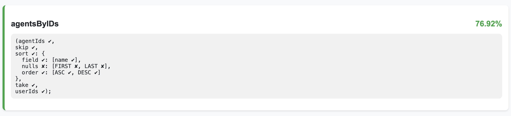

# Playwright-graphql
This library provides Playwright integration with GraphQL and TypeScript for efficient API testing.
It enables you to generate an auto-generated GraphQL API client with autocomplete functionality.


## 🌟 Features

- 🚀 Autogenerated GraphQL API client with TypeScript autocomplete
- 📊 Comprehensive schema and operation generation
- 🔍 Flexible request handling and response management
- 📈 Optional GraphQL coverage reporting

The build-in CLI simplifies code generation process to one simple command.
```bash
playwright-graphql --schema schema.gql
```

- [Project Setup](#project-setup)
- [Installation](#installation)
- [Generate type safe client](#generate-type-safe-client)
- [Add path to your tsconfig](#add-path-to-your-tsconfig)
- [Create gql fixtures](#create-gql-fixture)
- [Code generation with build in CLI](#code-generation-with-build-in-cli)
    - [Raw Response](#return-raw-response-body-instead-of-schema-defined-type)
    - [Get Client signature](#get-client-signature)
    - [Custom operations](#custom-operations)
    - [Graphql explorer](#graphql-explorer)
    - [GraphQL API call options](#graphql-api-call-options)
    - [Negative Testing](#negative-test-cases)
    - [GraphQL Coverage Reporting](#graphql-coverage-reporting)


## Project setup:

1. Installation.
2. Generate type safe client.
3. Add GraphQL client fixture.
4. Write GraphQL tests with joy!

Template project: https://github.com/DanteUkraine/playwright-graphql-example

### Installation
To begin, install the playwright-graphql package. 
This library integrates GraphQL testing with Playwright and TypeScript, 
offering autocomplete and type safety for your API tests.

- `npm install playwright-graphql`

or for dev dependency
- `npm install -D playwright-graphql`


### Generate type safe client

```bash
playwright-graphql --schema path-to-schema.gql
```

Will generate you next:
```text
📁 Project Root
├── 📄 path-to-schema.gql (existing schema file)
└── 📁 gql (default directory for generated files)
    ├──📁 path-to-schema (will become a name for related operation directory)
    │  └── 📁 autogenerated-operations (contains all possible GraphQL operations)
    │      ├── 📄 mutations.gql
    │      └── 📄 queries.gql
    └── 📄 graphql.ts (generated TypeScript types and client)
```
When you run the command with an existing schema file, the CLI will:

1. Generate GraphQL operations based on your schema
2. Create a codegen configuration file
3. Generate TypeScript types for type-safe GraphQL operations
4. Add a client utility function for use with Playwright tests

The generated graphql.ts file will include a `getClient(apiContext, options?, callback?)` function and 
type `GqlAPI` that you can use in your Playwright fixture to return type-safe GraphQL client in tests.

In case you can not generate schema from GraphQL server directly:
```bash
playwright-graphql --url http://localhost:4000/api/graphql --schema schema.gql
```

Will generate you next:
```text
📁 Project Root
├── 📄 schema.gql (generated schema file)
└── 📁 gql (default directory for generated files)
    ├──📁 schema (each schema will have its own directory with operations)
    │  └── 📁 autogenerated-operations (contains all possible GraphQL operations)
    │      ├── 📄 mutations.gql
    │      └── 📄 queries.gql
    └── 📄 graphql.ts (generated TypeScript types and client)
```
When you run the command with a GraphQL endpoint URL, the CLI will:

1. Fetch the GraphQL schema from the specified URL and save to the specified file (schema.gql).
2. Save the schema to the specified file (schema.gql)
3. Generate GraphQL operations based on the fetched schema
4. Generate GraphQL type-safe client

This command is useful when you want to generate or update your schema file directly from a GraphQL endpoint. 
It combines the schema fetching step with the type-safe client generation, streamlining the setup process 
for your Playwright GraphQL tests.

The generated files and their purposes remain the same as in the previous command, 
but now you have the added benefit of automatically fetching and updating your schema file from the live GraphQL endpoint.

### Add path to your tsconfig

To simplify your imports and improve project readability, configure your `tsconfig.json` by adding custom path aliases. 
This makes it easier to import your generated GraphQL client across your project:

Add `"@gql": ["gql/graphql"]` for easy import.

```json
{
  "compilerOptions": {
    "target": "ESNext",
    "module": "ESNext",
    "moduleResolution": "node",
    "resolveJsonModule": true,
    "strict": true,
    "noUnusedLocals": false,
    "noUnusedParameters": false,
    "noFallthroughCasesInSwitch": true,
    "allowSyntheticDefaultImports": true,
    "baseUrl": "./",
    "paths": {
      "@fixtures/*": ["fixtures/*"],
      "@gql": ["gql/graphql"]
    }
  }
}
```
This setup allows you to import your client like this:
```ts
import { getClient, GqlAPI } from '@gql';
```

Note that the `@fixtures/*` path alias allows you to import any file from the fixtures directory as a module:
```ts
import { test, expect } from '@fixtures/gql';
```
Instead of using long relative paths.

### Create gql fixture

The final step creates a fixture for integrating the autogenerated GraphQL client with Playwright tests. 
The fixture returns Playwright GraphQl type safe API client into tests. 
Create a file (minimalistic example, *fixtures/gql.ts*) with the following content:

*fixtures/gql.ts*
```ts
import { test as baseTest, expect, request, APIRequestContext } from '@playwright/test';
import { getClient, GqlAPI } from '@gql';

export { expect };

type WorkerFixtures = {
    apiContext: APIRequestContext;
    gql: GqlAPI;
};

export const test = baseTest.extend<{}, WorkerFixtures>({
    apiContext: [
      async ({}, use) => {
        const apiContext = await request.newContext({
          baseURL: 'http://localhost:4000'
        });
        await use(apiContext);
      }, { scope: 'worker' } 
    ],
    gql: [
        async ({ apiContext }, use) => {
            await use(getClient(apiContext));
        }, { auto: false, scope: 'worker' }
    ]
});
```
This fixture ensures that your tests have a consistent and type-safe GraphQL client available, and it leverages
Playwright’s API request context for efficient testing.

Full configurability example: 
```ts
import { test as baseTest, expect, request, APIRequestContext } from '@playwright/test';
import { getClient, GqlAPI, RequesterOptions, RequestHandler } from '@gql';

export { expect };

const options: RequesterOptions = {
  gqlEndpoint: 'api/gql', 
  rawResponse: true
};

// This optional callback allows user to add custom logic to gql api call.
const requestHandlerCallback: RequestHandler = async (request: () => Promise<APIResponse>) => {
  console.log('Before api call');
  const res = await request();
  console.log(`After api call: ${res.status()}`);
  return res;
};

type WorkerFixtures = {
    apiContext: APIRequestContext;
    gql: GqlAPI;
};

export const test = baseTest.extend<{}, WorkerFixtures>({
    apiContext: [
      async ({}, use) => {
        const apiContext = await request.newContext({
          baseURL: 'http://localhost:4000'
        });
        await use(apiContext);
      }, { scope: 'worker' } 
    ],
    gql: [
        async ({ apiContext }, use) => {
            await use(getClient(apiContext, options, requestHandlerCallback));
        }, { auto: false, scope: 'worker' }
    ]
});
```
This full example shows how to customize GraphQL endpoint, type of response, and add custom logic to GraphQL API calls.

Now, you can write your tests using the fixture.

#### You are ready to jump into writing tests!

*tests/example.test*:
```ts
import { test, expect } from '@fixtures/gql';

test('playwright-graphql test', async ({ gql }) => {
    const res = await gql.getCityByName({
        name: 'Lviv'
    });

    expect(res.getCityByName).not.toBeNull();
})
```
___

## Code generation with build in CLI

Designed for common workflow, the playwright-graphql CLI tool automates the process of generating
GraphQL schemas, operations, and TypeScript types for your Playwright tests.

Use cases:

Basic client generation:

- `playwright-graphql --url http://localhost:4000/api/graphql`

Schema generation with authentication:

- `playwright-graphql --url http://localhost:4000/api/graphql --header "Authorization: Bearer token"`

Syntax for complex headers:
- `playwright-graphql --url http://localhost:4000/api/graphql -h "Cookies={'Authorization': 'Bearer token'}"`

Custom paths for generated files:

- `playwright-graphql --url http://localhost:4000/api/graphql --gqlDir generated/test-client --gqlFile my-api-client.ts`

Using an existing schema file:

- `playwright-graphql --schema existing-schema.gql`

Enabling coverage logging:

- `playwright-graphql --url http://localhost:4000/api/graphql --coverage`

Custom operations without introspection:

- `playwright-graphql --url http://localhost:4000/api/graphql --introspect false --document src/operations`

Using a custom codegen configuration:

- `playwright-graphql --custom --codegen path/to/codegen.ts`

You can save `codegen.ts` file for your combination:

- `playwright-graphql -u http://localhost:4000/api/graphql --saveCodegen`

Generate multiple clients:

- `playwright-graphql -u http://localhost:4000/api/graphql -u http://localhost:4000/api/graphql -s schema1.gql -s schema2.gql`

_Output:_
```text
📁 Project Root
├── 📄 schema1.gql
├── 📄 schema2.gql
└── 📁 gql
    ├──📁 schema1
    │  └── 📁 autogenerated-operations
    │      ├── 📄 mutations.gql
    │      └── 📄 queries.gql
    ├──📁 schema2
    │  └── 📁 autogenerated-operations
    │      ├── 📄 mutations.gql
    │      └── 📄 queries.gql
    └── 📄 schema1.ts 
    └── 📄 schema2.ts
```
When you generate multiple clients and do not specify name for ts file with `-f`, CLI will not reuse default name graphql.ts,
each client name will match schema name to make it clear.

Specify client names:
- `playwright-graphql -u http://localhost:4000/api/graphql -u http://localhost:4000/api/graphql -s schema1.gql -s schema2.gql -f gqlClient -f gqlApi`

_Output:_
```text
📁 Project Root
├── 📄 schema1.gql
├── 📄 schema2.gql
└── 📁 gql
    ├──📁 schema1
    │  └── 📁 autogenerated-operations
    │      ├── 📄 mutations.gql
    │      └── 📄 queries.gql
    ├──📁 schema2
    │  └── 📁 autogenerated-operations
    │      ├── 📄 mutations.gql
    │      └── 📄 queries.gql
    └── 📄 gqlClient.ts 
    └── 📄 gqlApi.ts
```

Generate multiple clients with custom operations:

- `playwright-graphql -u http://localhost:4000/api/graphql -u http://localhost:4000/api/graphql -s schema1.gql -s schema2.gql -o ./schema1-operations, -o ./schema2-operations`

_Output:_
```text
📁 Project Root
├── 📄 schema1.gql
├── 📄 schema2.gql
├── 📁 schema1-operations 
├── 📁 schema2-operations
└── 📁 gql
    ├──📁 schema1
    │  └── 📁 autogenerated-operations
    │      ├── 📄 mutations.gql
    │      └── 📄 queries.gql
    ├──📁 schema2
    │  └── 📁 autogenerated-operations
    │      ├── 📄 mutations.gql
    │      └── 📄 queries.gql  
    └── 📄 schema1.ts // this client will include operations from project root schema1-operations
    └── 📄 schema2.ts // this client will include operations from project root schema2-operations
```

In case not all your clients need custom operations, for example only schema2 need custom operations change the order of args.

- `playwright-graphql -u http://localhost:4000/api/graphql -u http://localhost:4000/api/graphql -s schema2.gql -s schema1.gql -o ./schema2-operations`

_Output:_
```text
📁 Project Root
├── 📄 schema1.gql
├── 📄 schema2.gql
├── 📁 schema2-operations
└── 📁 gql
    ├──📁 schema1
    │  └── 📁 autogenerated-operations
    │      ├── 📄 mutations.gql
    │      └── 📄 queries.gql
    ├──📁 schema2
    │  └── 📁 autogenerated-operations
    │      ├── 📄 mutations.gql
    │      └── 📄 queries.gql  
    └── 📄 schema1.ts
    └── 📄 schema2.ts // this client will include operations from project root schema2-operations
```
Document params will be added to lists of documents regarding order

To check details save codegen file and verify output of your command.

### CLI Options
The CLI tool accepts several options to customize its behavior.
Below is a summary of the available command-line parameters:

| Option          | Alias | Description                                                                                                                                                             | Type    | Default        |
|-----------------|-------|-------------------------------------------------------------------------------------------------------------------------------------------------------------------------|---------|----------------|
| `--url`         | `-u`  | Full GraphQL endpoint URL(s) used for schema retrieval. In case this option is not passed, the script will skip schema generation and will look for an existing schema. | array   | *optional*     |
| `--schema`      | `-s`  | Path to save the generated GraphQL schema file(s). If the URL option is not provided, the script expects that the schema already exists.                                | array   | [`schema.gql`] |
| `--header`      | `-h`  | Optional authentication header(s) for schema fetching. Can be passed multiple times.                                                                                    | array   | *optional*     |
| `--gqlDir`      | `-d`  | Path to save the auto-generated GraphQL files.                                                                                                                          | string  | `gql`          |
| `--gqlFile`     | `-f`  | Path to save the auto-generated GraphQL type-safe client (you will import this into your code).                                                                         | array   | [`graphql.ts`] |
| `--document`    | `-o`  | Glob pattern(s) that will be added to documents.	                                                                                                                       | array   | *optional*     |
| `--introspect`  | `-i`  | Turns off auto-generation of operations.                                                                                                                                | boolean | true           |
| `--raw`         |       | Generates GraphQL client witch return raw responses.                                                                                                                    | boolean | false          |
| `--codegen`     | `-c`  | Path to save the codegen config.                                                                                                                                        | string  | `codegen.ts`   |
| `--saveCodegen` |       | Save generated codegen file.                                                                                                                                            | boolean | false          |
| `--custom`      |       | Generation will be done from your custom codegen file. No autogenerated operation.                                                                                      | boolean | false          |
| `--coverage`    |       | Flag to add coverage logger to auto-generated client.                                                                                                                   | boolean | false          |
| `--version`     |       | Print version.                                                                                                                                                          |         |                |
| `--help`        |       | Print all CLI options.                                                                                                                                                  |         |                |

### Return raw response body instead of schema defined type.

You can configure the library to return the raw GraphQL response body instead of the schema-defined types. 
This is useful when you need full control over the response payload.

**Steps to Enable Raw Response:**

1. Add `rawRequest: true` under the `codegen.ts` file.
Note that when rawRequest is set to true, you must also enable rawResponse in your client setup:
`getClient(apiContext, { rawResponse: true })`.

*codegen.ts file*:
```ts
import type { CodegenConfig } from '@graphql-codegen/cli';

const config: CodegenConfig = {
  overwrite: true,
  schema: './schema.gql',
  documents: [
    'gql/autogenerated-operations/**/*.gql',
  ],
  generates: {
    'gql/graphql.ts': {
      plugins: ['typescript', 'typescript-operations', 'typescript-generic-sdk'],
      config: {
          rawRequest: true,
          scalars: {
          BigInt: 'bigint|number',
          Date: 'string',
        },
      },
    },
  },
};

export default config;
```

2. Update the GraphQL client in your fixture.
Pass `{ rawResponse: true }` to `getClient`: 

*fixtures/gql.ts*
```ts
getClient(apiContext, { rawResponse: true });
```

3. Use the raw response in your tests. 
The raw response will include both data and errors:

*tests/example.test*
```ts
import { test, expect } from '@fixtures/gql';

test('playwright-graphql test', async ({ gql }) => {
    const res = await gql.getCityByName({
        name: 'Lviv'
    });
    
    expect(res).toHaveProperty('data');
    expect(res).toHaveProperty('errors');
    res.data; // will have type raw schema.
})
```
---

### Get Client signature

```ts
getClient(
  apiContext: APIRequestContext,
  options?: { gqlEndpoint?: string; rawResponse?: boolean },
  requestHandler?: (request: () => Promise<any>) => Promise<any>
);

```

#### Options:

Default values for options: `{ gqlEndpoint: '/api/graphql', rawResponse: false }`

Set `gqlEndpoint` to customize graphql endpoint.

Set `rawResponse` to return { errors: any[], body: R } instead of R, R represents autogenerated return type from gql schema. 
This parameter can be used only when `rawRequest: true` is included in `codegen.ts`.


#### Request Handler Callback

You can inject custom logic before and after GraphQL API calls using a request handler callback:

```typescript
import { getClient, GqlAPI } from '@gql';

const customRequestHandler = async (requester: () => Promise<APIResponse>) => {
  // Custom pre-call logic
  const res = await requester();
  // Custom post-call logic
  return res;
};

const gqlApiClient: GqlAPI = getClient(apiContext, { gqlEndpoint: '/api/graphql' }, customRequestHandler);
```

### Custom operations

Collect your custom operations under any directory in your project and pass it to CLI.

- `playwright-graphql --url http://localhost:4000/api/graphql -o src/operations`

That will build your client with autogenerated and your custom operations.

To use only your custom operations add introspect flag.

- `playwright-graphql --url http://localhost:4000/api/graphql -o src/operations -i`

### Graphql explorer
You can use tools like [Apollo Explorer](https://studio.apollographql.com/sandbox/explorer) to build and test custom
queries or mutations interactively before adding them to your project.

### GraphQL API call options

Each generated operation accepts an optional second parameter for additional configuration options.
These options extend Playwright's [post method](https://playwright.dev/docs/api/class-apirequestcontext#api-request-context-post)
method with two extra parameters:

- `returnRawJson` Returns the full JSON payload instead of parsed data.
- `failOnEmptyData` Prevents errors when the response contains no data (useful for error testing).

Here is how the second parameter type is declared.
```ts
type PlaywrightRequesterOptions = {
    returnRawJson?: boolean;
    failOnEmptyData?: boolean;
} & Omit<PostOptionsType, 'data'>;
```

*Example Usage in Tests:*
```ts
import { test, expect } from '@fixtures/gql';

test('playwright-graphql test with options', async ({ gql }) => {
  const res = await gql.getCityByName(
    { name: 'Lviv' },
    { returnRawJson: true }
  );

  expect(res).toHaveProperty('data');
});

```
### Negative test cases
GraphQL responses often include an `errors` field instead of returning HTTP error codes like
`400x` or `500x`. To verify errors in such cases, use the option `failOnEmptyData`.

*Example Negative Test Case:*
```ts
import { test, expect } from '@fixtures/gql';

test('playwright-graphql test negative', async ({ gql }) => {
    const res = await gql.getCityByName({
        name: 'Lviv'
    }, { failOnEmptyData: false });

    expect(res).toHaveProperty('errors[0].message');
})
```

---

### GraphQL Coverage Reporting

GraphQL Coverage Reporting helps you track and visualize which GraphQL operations and their 
respective arguments are exercised by your tests. This feature not only covers simple queries and mutations but also
handles complex input parameters (including nested types and enums) by presenting them in a clear, human-readable summary.

Generates a detailed log and an HTML summary report showing the coverage of your GraphQL operations:


Playwright config file for the GraphQL coverage reporter:
1. **graphqlFilePath** (required): Path to your autogenerated GraphQL file with types and getClient function (e.g. './gql/graphql.ts').
2. **coverageFilePath** (optional): Path for the coverage log file. Default: `./gql-coverage.log`.
3. **htmlFilePath** (optional): Path for the HTML summary report. Default: './gql-coverage.html'.
4. **logUncoveredOperations** (optional): Whether to log uncovered operations. Default: false.
5. **minCoveragePerOperation** (optional): Minimum coverage percentage required per operation. Default: 100.
6. **saveGqlCoverageLog** (optional): Whether to save the detailed coverage log. Default: false.
7. **saveHtmlSummary** (optional): Whether to save the HTML summary report. Default: false.

Below is a sample Playwright config using these options:
```typescript
import { defineConfig } from '@playwright/test';

export default defineConfig({
    reporter: [
        ['list'],
        ['playwright-graphql/coverage-reporter', {
            graphqlFilePath: './gql/graphql.ts', 
            coverageFilePath: './coverage/gql-coverage.log',
            htmlFilePath: './coverage/gql-coverage.html',
            logUncoveredOperations: true,
            minCoveragePerOperation: 80,
            saveGqlCoverageLog: true,
            saveHtmlSummary: true
        }]
    ],
});

```
In case you generate multiple clients each client coverage reporter has to be specified separately.


### Integrating the Coverage Logger into Your GraphQL Client

To enable coverage tracking for your GraphQL requests add `--coverage` to playwright-graphql cli.

- `playwright-graphql --coverage`


Template project: https://github.com/DanteUkraine/playwright-graphql-example