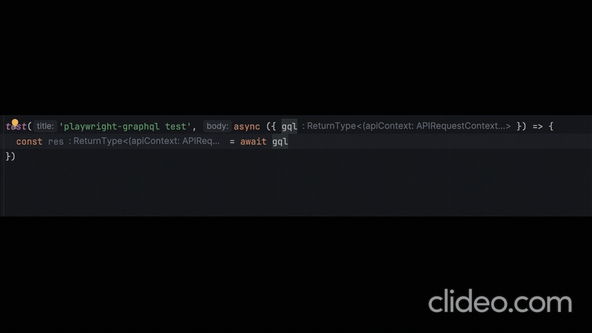

# Playwright-graphql
This library provides Playwright integration with GraphQL and TypeScript for efficient API testing.
It enables you to generate an auto-generated GraphQL API client with autocomplete functionality.


## 🌟 Features

- 🚀 Autogenerated GraphQL API client with TypeScript autocomplete
- 📊 Comprehensive schema and operation generation
- 🔍 Flexible request handling and response management
- 📈 Optional GraphQL coverage reporting

To build the GraphQL client, this library leverages several GraphQL libraries, such as:

- [get-graphql-schema](https://www.npmjs.com/package/get-graphql-schema) to generate schema.
- [gql-generator](https://www.npmjs.com/package/gql-generator) to generate operations (queries and mutations).
- [@graphql-codegen/cli and @graphql-codegen/typescript-generic-sdk](https://the-guild.dev/graphql/codegen/plugins/typescript/typescript-generic-sdk) It accepts a Codegen configuration file as input and generates a TypeScript file containing all types and operations (excluding the API client).

- [Project Setup](#project-setup)
- [Installation](#installation)
- [Generate graphql schema](#generate-graphql-schema-from-server-under-test)
- [Generate operations from schema](#generate-operations-from-schema)
- [Create codegen.ts file](#create-codegen-file)
- [Type Generation](#generate-types)
- [Add path to your tsconfig](#add-path-to-your-tsconfig)
- [Create gql fixtures](#create-gql-fixture)
    - [Raw Response](#return-raw-response-body-instead-of-schema-defined-type)
    - [Request Handler Callback](#request-handler-callback)
    - [Custom operations](#more-about-codegents-configuration)
    - [Graphql explorer](#graphql-explorer)
    - [Code generation scripts](#code-generation-scripts)
    - [Operation options](#operation-options)
    - [Negative Testing](#negative-test-cases)
    - [GraphQL Coverage Reporting](#graphql-coverage-reporting)


## Project setup:

1. Installation.
2. Generate schema and operations.
3. Generate typescript types.
4. Add graphql client fixture.
5. Wright GraphQL tests with joy!

Template project: https://github.com/DanteUkraine/playwright-graphql-example

### Installation
To begin, install the playwright-graphql package.
This library integrates GraphQL testing with Playwright and TypeScript,
offering autocomplete and type safety for your API tests.

- `npm install playwright-graphql`

or for dev dependency
- `npm install -D playwright-graphql`

### Generate graphql schema from server under test

Generating your GraphQL schema is an optional but useful step when your system under test (SUT)
has introspection enabled. This command retrieves the schema from your GraphQL endpoint.
If your tests live in the same repository as your backend—or if you use an alternative tool
for schema generation—this step can be skipped.

Run the following command (replacing <baseUrl> and your actual graphql endpoint):

- `get-graphql-schema https://${baseUrl}/api/graphql > schema.gql`

After executing this command, you will have a schema.gql file in your working directory containing your GraphQL schema.

In case you need to pass Auth headers:
- `get-graphql-schema https://${baseUrl}/api/graphql > schema.gql -h "Authentication=Bearer ${your_token}"`

In case your Auth header is inside Cookies:
- `get-graphql-schema https://${baseUrl}/api/graphql > schema.gql -h "Cookie={Authentication: Bearer ${your_token}}"`

Such way is used because `get-graphql-schema` puts value in `JSON.parse` function.

### Generate operations from schema

Manually generating operations using schema inspectors like Apollo can be a lengthy process.
Instead, run the following command to auto-generate operations from your schema:

- `gqlg --schemaFilePath ./schema.gql --destDirPath ./gql/autogenerated-operations`

This command creates a new directory (*gql/autogenerated-operations/*) with `.gql` files containing your GraphQL queries and mutations.

### Create codegen file
Next, create a codegen.ts file to automatically generate TypeScript types for your operations.
This file leverages the @graphql-codegen/cli and the typescript-generic-sdk plugin to generate a
file that includes types and operations for your API client. Here’s an example configuration:

Create `codegen.ts` file:
```ts
import type { CodegenConfig } from '@graphql-codegen/cli';

const config: CodegenConfig = {
  overwrite: true,
  schema: './schema.gql',
  documents: [
    'gql/autogenerated-operations/**/*.gql',
  ],
  generates: {
    'gql/graphql.ts': {
      plugins: ['typescript', 'typescript-operations', 'typescript-generic-sdk'],
      config: {
        scalars: {
          BigInt: 'bigint|number',
          Date: 'string',
        },
      },
    },
  },
};

export default config;
```

### Generate types

Finally, run the following command to generate your TypeScript types:

- `graphql-codegen --config codegen.ts` generates graphql.ts in gql directory.

This command creates the `gql/graphql.ts` file with all the types for your GraphQL queries and mutations,
ensuring a type-safe development experience

In case you need to customize output check [docs](https://the-guild.dev/graphql/codegen/plugins/typescript/typescript).

### Add path to your tsconfig

To simplify your imports and improve project readability, configure your tsconfig.json by adding custom path aliases.
This makes it easier to import your generated GraphQL client across your project:

Add `"@gql": ["gql/graphql"]` for easy import.

```json
{
  "compilerOptions": {
    "target": "ESNext",
    "module": "ESNext",
    "moduleResolution": "node",
    "resolveJsonModule": true,
    "strict": true,
    "noUnusedLocals": false,
    "noUnusedParameters": false,
    "noFallthroughCasesInSwitch": true,
    "allowSyntheticDefaultImports": true,
    "baseUrl": "./",
    "paths": {
      "@fixtures/*": ["fixtures/*"],
      "@gql": ["gql/graphql"]
    }
  }
}
```
This setup allows you to import your client like so:
```ts
import { getSdk } from '@gql';
```
Pay attention on path `@fixtures/*` it allows to resolve file with fixtures `gql.ts` as:
```ts
import { test, expect } from '@fixtures/gql';
```
Instead of using long relative paths.

### Create gql fixture

The final step is to create a GraphQL fixture for integrating the autogenerated client with Playwright tests.
The fixture sets up an API request context and wraps the client into a Playwright test fixture.
Create a file (for example, *fixtures/gql.ts*) with the following content:

*fixtures/gql.ts*
```ts
import { test as baseTest, expect, request, APIRequestContext } from '@playwright/test';
import { getSdkRequester } from 'playwright-graphql';
import { getSdk } from '@gql';

export { expect };

const getClient = (apiContext: APIRequestContext) => getSdk(getSdkRequester(apiContext));

type WorkerFixtures = {
    gql: ReturnType<typeof getClient>;
};

export const test = baseTest.extend<{}, WorkerFixtures>({
    gql: [
        async ({}, use) => {
            const apiContext = await request.newContext({
                baseURL: 'http://localhost:4000'
            });
            await use(getClient(apiContext));
        }, { auto: false, scope: 'worker' }
    ]
});
```
Now, you can write your tests using the fixture.

#### You are ready jump into writing tests!

*tests/example.test*:
```ts
import { test, expect } from '@fixtures/gql';

test('playwright-graphql test', async ({ gql }) => {
    const res = await gql.getCityByName({
        name: 'Lviv'
    });

    expect(res.getCityByName).not.toBeNull();
})
```

This fixture ensures that your tests have a consistent and type-safe GraphQL client available, and it leverages
Playwright’s API request context for efficient testing.

---
### Return raw response body instead of schema defined type.

You can configure the library to return the raw GraphQL response body instead of the schema-defined types.
This is useful when you need full control over the response payload.

**Steps to Enable Raw Response:**

1. Add `rawRequest: true` under the `codegen.ts` file.
   Note that when rawRequest is set to true, you must also enable rawResponse in your client setup:
   `getSdkRequester(apiContext, { rawResponse: true })`.

*codegen.ts file*:
```ts
import type { CodegenConfig } from '@graphql-codegen/cli';

const config: CodegenConfig = {
  overwrite: true,
  schema: './schema.gql',
  documents: [
    'gql/autogenerated-operations/**/*.gql',
  ],
  generates: {
    'gql/graphql.ts': {
      plugins: ['typescript', 'typescript-operations', 'typescript-generic-sdk'],
      config: {
          rawRequest: true,
          scalars: {
          BigInt: 'bigint|number',
          Date: 'string',
        },
      },
    },
  },
};

export default config;
```

2. Update the GraphQL client in your fixture.
   Pass `{ rawResponse: true }` to `getSdrRequester`:

*fixtures/gql.ts*
```ts
const getClient = (apiContext: APIRequestContext) => getSdk(getSdkRequester(apiContext, { rawResponse: true }));
```

3. Use the raw response in your tests.
   The raw response will include both data and errors:

*tests/example.test*
```ts
import { test, expect } from '@fixtures/gql';

test('playwright-graphql test', async ({ gql }) => {
    const res = await gql.getCityByName({
        name: 'Lviv'
    });
    
    expect(res).toHaveProperty('data');
    expect(res).toHaveProperty('errors');
    res.data; // will have type raw schema.
})
```
---
### Request Handler Callback

You can inject custom logic before and after GraphQL API calls using a request handler callback:

```typescript
const customRequestHandler = async (requester: () => Promise<APIResponse>) => {
  // Custom pre-call logic
  const res = await requester();
  // Custom post-call logic
  return res;
};

const getClient = (apiContext: APIRequestContext) =>
  getSdk(
    getSdkRequester(apiContext, {
      gqlEndpoint: '/api/graphql',
      requestHandler: customRequestHandler
    })
  );
```

### Get SDK Requester signature

```ts
getSdkRequester(
  apiContext: APIRequestContext,
  options?: { gqlEndpoint?: string; rawResponse?: boolean },
  requestHandler?: (request: () => Promise<any>) => Promise<any>
);

```

Default values for options: `{ gqlEndpoint: '/api/graphql', rawResponse: false }`

Set `gqlEndpoint` to customize graphql endpoint.

Set `rawResponse` to return { errors: any[], body: R } instead of R, R represents autogenerated return type from gql schema.
This parameter can be used only when `rawRequest: true` is included in `codege.ts`.

---

### More about codegen.ts configuration

If you need to create custom operations for specific tests,
you can modify the `codegen.ts` file to include additional paths for documents:

*Steps to Add Custom Operations:*

1. Update the documents section in your codegen.ts file:

```ts
import type { CodegenConfig } from '@graphql-codegen/cli';

const config: CodegenConfig = {
  overwrite: true,
  schema: './schema.gql',
  documents: [
    'gql/autogenerated-operations/**/*.gql',
    'gql/custom-operations/**/*.gql',
  ],
  generates: {
    'gql/graphql.ts': {
      plugins: ['typescript', 'typescript-operations', 'typescript-generic-sdk'],
      config: {
        scalars: {
          BigInt: 'bigint|number',
          Date: 'string',
        },
      },
    },
  },
};

export default config;
```
Pay attention on addition item in documents:
`'gql/custom-operations/**/*.gql'` put you custom gql files under this directory.

2. Add generated files and directories to `.gitignore`:

```gitignore
gql/autogenerated-operations
gql/**/*.ts
gql/**/*.js
```

3. Regenerate types with custom operations.

### Graphql explorer
You can use tools like Apollo Explorer to build and test custom queries or mutations interactively before adding them to your project.

### Code generation scripts
Here are example scripts for automating schema generation, operation generation, and type generation:

```json
  "scripts": {
    "generate:schema": "get-graphql-schema http://localhost:4000/api/graphql > schema.gql",
    "generate:operations": "gqlg --schemaFilePath ./schema.gql --destDirPath ./gql/autogenerated-operations --depthLimit 6",
    "generate:types": "graphql-codegen --config codegen.ts",
    "codegen": "npm run generate:schema && npm run generate:operations && npm run generate:types",
    "test": "npx playwright test"
  },
```

Such setup will aloow you to build gql type safe client by executing:

```shell
npm run codegen
```

### Operation options

Each generated operation accepts an optional second parameter for additional configuration options.
These options extend Playwright's [post method](https://playwright.dev/docs/api/class-apirequestcontext#api-request-context-post)
method with two extra parameters:

- `returnRawJson` Returns the full JSON payload instead of parsed data.
- `failOnEmptyData` Prevents errors when the response contains no data (useful for error testing).

That is how second parameter type is declared.
```ts
type PlaywrightRequesterOptions = {
    returnRawJson?: boolean;
    failOnEmptyData?: boolean;
} & Omit<PostOptionsType, 'data'>;
```

*Example Usage in Tests:*
```ts
import { test, expect } from '@fixtures/gql';

test('playwright-graphql test with options', async ({ gql }) => {
  const res = await gql.getCityByName(
    { name: 'Lviv' },
    { returnRawJson: true }
  );

  expect(res).toHaveProperty('data');
});

```
### Negative test cases
GraphQL responses often include an `errors` field instead of returning HTTP error codes like
`400x` or `500x`. To verify errors in such cases, use the option `failOnEmptyData`.

*Example Negative Test Case:*
```ts
import { test, expect } from '@fixtures/gql';

test('playwright-graphql test negative', async ({ gql }) => {
    const res = await gql.getCityByName({
        name: 'Lviv'
    }, { failOnEmptyData: false });

    expect(res).toHaveProperty('errors[0].message');
})
```

---

### GraphQL Coverage Reporting

GraphQL Coverage Reporting helps you track and visualize which GraphQL operations and their
respective arguments are exercised by your tests. This feature not only covers simple queries and mutations but also
handles complex input parameters (including nested types and enums) by presenting them in a clear, human-readable summary.

Generates a detailed log and an HTML summary report showing the coverage of your GraphQL operations:


Playwright config file for the GraphQL coverage reporter:
1. **graphqlFilePath** (required): Path to your autogenerated GraphQL file produced by getSdk (e.g. './gql/graphql.ts').
2. **coverageFilePath** (optional): Path for the coverage log file. Default: `./gql-coverage.log`.
3. **htmlFilePath** (optional): Path for the HTML summary report. Default: './gql-coverage.html'.
4. **logUncoveredOperations** (optional): Whether to log uncovered operations. Default: false.
5. **minCoveragePerOperation** (optional): Minimum coverage percentage required per operation. Default: 100.
6. **saveGqlCoverageLog** (optional): Whether to save the detailed coverage log. Default: false.
7. **saveHtmlSummary** (optional): Whether to save the HTML summary report. Default: false.

Below is a sample Playwright config using these options:
```typescript
import { defineConfig } from '@playwright/test';

export default defineConfig({
    reporter: [
        ['list'],
        ['playwright-graphql/coverage-reporter', {
            graphqlFilePath: './gql/graphql.ts', 
            coverageFilePath: './coverage/gql-coverage.log',
            htmlFilePath: './coverage/gql-coverage.html',
            logUncoveredOperations: true,
            minCoveragePerOperation: 80,
            saveGqlCoverageLog: true,
            saveHtmlSummary: true
        }]
    ],
});

```
#### Environment Variable Override

If you need to change the default temporary directory where coverage log files are stored,
set the environment variable `process.env.PW_GQL_TEMP_DIR`.

By default, the coverage logs are saved in a directory named `.gql-coverage`.

### Integrating the Coverage Logger into Your GraphQL Client

To enable coverage tracking for your GraphQL requests, wrap your SDK with the coverageLogger in the GraphQL fixture.
For example, in your fixtures file (e.g. fixtures/gql.ts):

*fixtures/gql.ts*
```ts
import { test as baseTest, expect, request, APIRequestContext } from '@playwright/test';
import { getSdkRequester, coverageLogger } from 'playwright-graphql';
import { getSdk } from '@gql';


const getClient = (apiContext: APIRequestContext) => coverageLogger(getSdk(getSdkRequester(apiContext)));
```

Template project: https://github.com/DanteUkraine/playwright-graphql-example